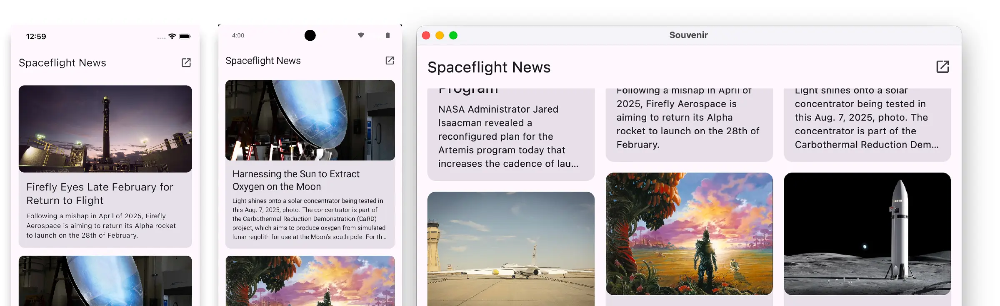

# KMP Sample

A multi-module Kotlin Multiplatform (KMP) application built to demonstrate modern development best
practices. It consumes the [Spaceflight News API](https://spaceflightnewsapi.net/) to provide a
list-detail view of the latest spaceflight articles.

## AI Disclosure

This project is developed with AI assistance. I guide the implementation and review every
AI-generated line to check whether it is necessary and follows best practices. For example, I
refined the [convention plugins' build file](build-logic/convention/build.gradle.kts) line by line
to keep the configuration minimal. I also reworked
the [Navigation 3 back stack](shared/src/commonMain/kotlin/com/github/deweyreed/souvenir/App.kt)
multiple times to find the most straightforward approach.

## Screenshots

## Features

- **Cross-Platform UI** - 100% shared UI using Compose Multiplatform
- **Offline-First** - Caches network requests using Room (KMP) for seamless offline viewing
- **Modern State Management** - Unidirectional Data Flow using the MVI (Model-View-Intent) pattern
- **Deep Modularization** - Strict separation of concerns via feature-based multi-module
  architecture

## Architecture

This project utilizes **Clean Architecture** combined with a multi-module setup managed by **Gradle
Convention Plugins** (`build-logic`). The project is split into the following layers:

- `base` - Core utilities and base classes
- `feature` - Feature modules
    - `api` - Public models and interfaces
    - `data` - Internal implementation (Repositories, Network, Database)
    - `presentation` - UI, ViewModels, and Composables
- `data` - Core module that collects feature `data` modules
- `shared` - The module that wires dependencies together using dependency injection
- `androidApp`, `iosApp`, `desktopApp` - The app entry points

## Tech Stack

- **Core:** [Kotlin Multiplatform](https://kotlinlang.org/docs/multiplatform.html),
  [Coroutines](https://kotlinlang.org/docs/coroutines-overview.html),
  [Flow](https://kotlinlang.org/docs/flow.html), [Metro](https://zacsweers.github.io/metro/) (
  dependency injection)
- **UI:** [Compose Multiplatform](https://www.jetbrains.com/lp/compose-multiplatform/),
  [Navigation 3](https://kotlinlang.org/docs/multiplatform/compose-navigation-3.html),
  [Coil](https://coil-kt.github.io/coil/)
- **Data:** [Ktor](https://ktor.io/),
  [Room 3](https://developer.android.com/kotlin/multiplatform/room),
  [DataStore](https://developer.android.com/kotlin/multiplatform/datastore),
  [Kotlinx Serialization](https://github.com/Kotlin/kotlinx.serialization)
- **Build and CI:** Gradle convention plugins, version catalogs, GitHub Actions
- **Tests and lint:** `kotlin-test`, `ktor-client-mock`, Android Lint,
  [compose-lints](https://slackhq.github.io/compose-lints/)

## Roadmap

- [x] Replace Koin with Metro(Kotlin 2.3.20)
- [x] Add `feature:settings`
- [x] Replace Nav2 with Nav3
- [x] Room 3
- [ ] Add icons
- [ ] Build binaries with CI

## License

[Apache License 2.0](LICENSE)
